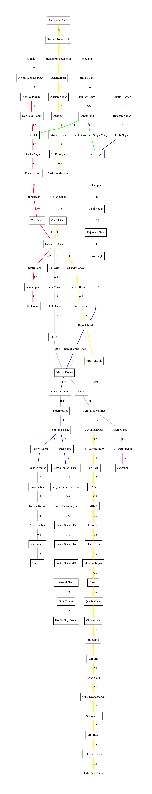

# MetroMate

📌📌 Please don't get confused, this is NOT an ANDROID Application!

This is a simple C++ console based application that will take information (name) of the source station and the destination station, of Delhi Metro, from the user and display the fare and shortest metro route to reach the destination.

## Acknowledgments

* [DMRC](http://www.delhimetrorail.com/)
* [Wikipedia](https://www.wikipedia.org/)

### Current Delhi Metro Stations (In my Program)

